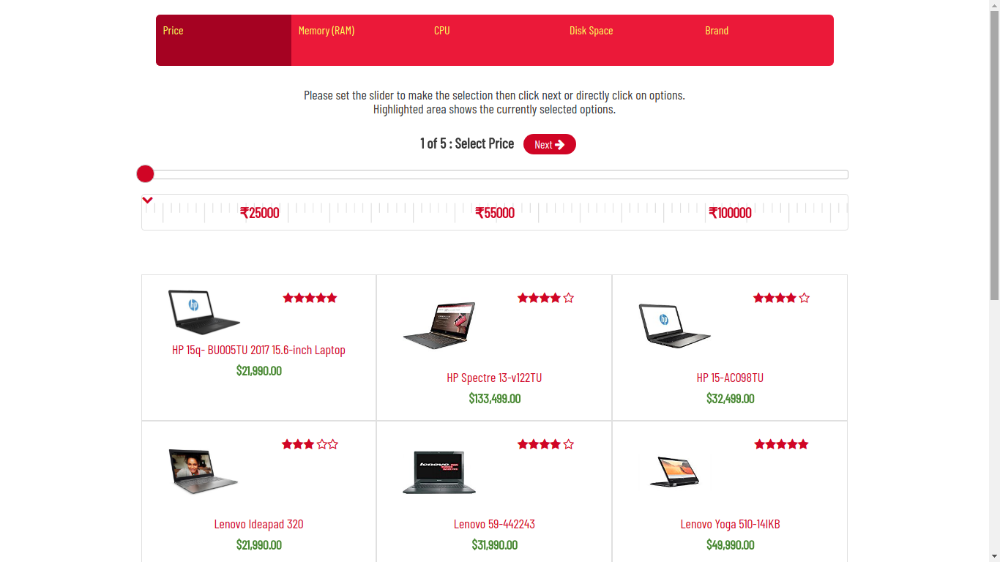

# Product filter

Product filter is simple angular5 based module. That accept the filter criteria in the form of JSON object and prepare the steps on the view. User is provided with 3 options at each step to choose from. User's choice is highlighted in the top step header along the way. User can directly jump to the any of the steps at any time and can also select combination of the two adjoining choices by sliding the slider in between. User is allowed to revert his selection coming back to the previous step too. As the user moves ahead making their filter choices the product list automatically gets filtered side by side.  

## Demo
See Demo here [Demo](http://projects.evolvan.com/product-filter)

## Screenshot

## Run On localhost

Run `ng serve` for a dev server. Navigate to `http://localhost:4200/`. The app will automatically reload if you change any of the source files.

## Build

Run `ng build` to build the project. The build artifacts will be stored in the `dist/` directory. Use the `-prod` flag for a production build.
